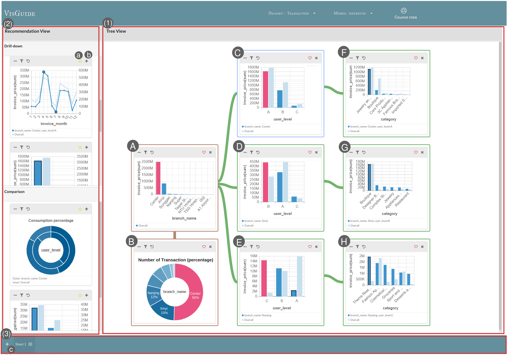
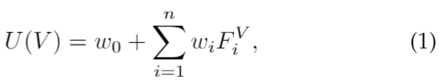
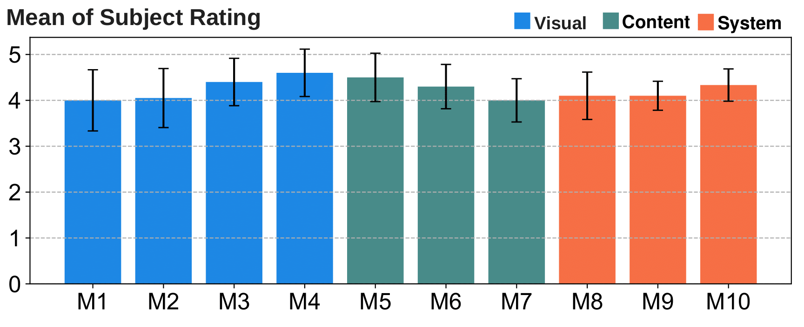
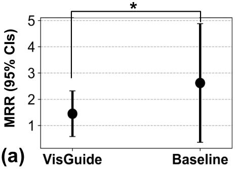
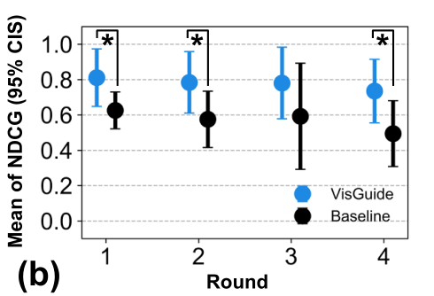

# VisGuide: User-oriented Recommendations for Data Event Extraction

**Data stories** are increasingly popular as a means for representing and organizing observations and patterns extracted from raw data. We proposed **VisGuide**, an interactive visualization tree generation tool that helps users create coherent visualization trees by recommending meaningful charts tailored to each user's data-exploration preferences. 

check [paper](https://dl.acm.org/doi/abs/10.1145/3491102.3517648) for details

check [video in CHI2022](https://www.youtube.com/watch?v=sjN5IBd-lVY)

## User Interface  [(DEMO VIDEO)](https://drive.google.com/file/d/1l28CLZgooxq0PeRy9tMNBYdWOQl_s5R9/view?usp=sharing)

  

### (1)Tree View 
Presents the generated visualization trees.
### (2)Recommendation View
Shows the next chart recommendations of the user-focused chart (Chart C). There are **Drill-down** and **Comparison** two types of the recommendation.
### (3)Sheet Management Bar
Supports users to create multiple visualization trees by adding a new sheet. Users can also switch among the sheets to compare the explored results.

## System Overview

**User interface** allows users to explore the data and show their further exploration intentions by clicking on their interested data points in charts. The selected charts are arranged in a **Tree like structure**, with which the user can intuitively examine patterns among charts.

**Back-end server** handles the recommendation process including creating candidate recommended charts and training the user preference model based on a user's interaction with the system. Afterwards, the system will predict the preference score of each candidate chart using the users' preference model. VisGuide then sorts  these charts based on the predictive preference score and return the result to the user interface.

**The database** store the raw dataset, created chart information, and all user exploration logs.

## Recommendation system

### Candidate Chart Generation
VisGuide applies **Drill-down** and **Comparison** operations to the user-focused chart to generate candidate next charts. 

* Drill-down: it combines the idea of the drill-down operation and the hierarchical structuring, which in effect zooms in to a data subset of interest by applyin filter condition.
* Comparison: it is designed also based on the hierarchical structuring, which facilitates users' own comparisons of different measures in the same data subset.

### User Preference Model Training
VisGuide's user preference model is a linear regression model of chart features that is trained online during a user's interaction processes and transferred when the user explores a new dataset. We map each chart to features and the preference score as label (which the preference score is obtain by the users' interaction with the system)

**User Preference label:**

We map 4 actions that users interact with the user interface with four-level numeric score from 0 to 1.
* Users click the **Heart** button: this chart will get score 1.0.
* Users add a chart from the \textit{Recommendation View} to the \textit{Tree View}: this chart will get score 0.6.
* Users click the **Star** button: this chart will get score 0.3.
* Any chart that is neither selected nor labeled: this chart will get score 0.0. 

**Chart features:**
* **(F1) Insight Significance measures:** the magnitude of insights in a chart. In this work, we only consider the point insights, e.g. extreme value
* **(F2) Deviation:** measures the difference between the probability distribution of a recommended candidate chart and that of the reference chart. We use Jensen-Shannon divergence (JSD) to measure the difference of two distributions.
* **(F3) Granularity:** The granularity feature quantifies the degree of such transitions (e.g., general-to-specific or specific-to-general) from one chart to its following recommended candidate charts. 
* **(F4) Consistence of generation operations:** This feature calculates the proportion of transitions in the sequence having the same generation operation. 
* **(F5) Encoding Transitions:** We record the channel encoding transition between two charts to capture a user's preference on the transition of the columns.

**Linear Regression Model:**

A user-oriented recommendation has two aspects: 
* (1) Capture the user preference on the data and the relation among visualizations
* (2) Bring along the learned user preferences on one dataset to a new dataset. 

We adopt an online machine learning method to learn users' personal preference model. We use the **stochastic gradient descent (SGD)** method to train a linear regression model.The SGD algorithm updates the weights to minimize the loss function, which is the least square error with L2 regularization. This model is then used to predict a particular user's preference score for each candidate chart. We define the utility function of a visualization as:

  

* V: a visualization chart
* wi : the weight of the ith
* FVi: chart features of V
* w0 : the intercept

We adopt the concept of **Transfer learning** to transfer across different learning tasks by reusing the weights of all dataset-independent features (i.e., F1, F2, F3, F4) learned from that user's previously explored datasets as the initial weights, which can reduce the user's labeling effort and to speed up its own learning process. 

## Evaluation
We design two experiment to evaluate two aspect of VisGuide:
* The usability of VisGuide  
* If the adaptive recommendation model can match a user’s interest and if the transfered model can provide a better initial recommendations 

**Study 1**

We conduct a qualitative experiment by designing the questionnaire that comprised ten 5-point Likert-scaled items, the scale ranged from 1=not at all to 5=very much:
* Visual: tree layout, insight hints, easy-to-understand, flexibility
* Story content: comprehensiveness, insightful, quality
* Overall usability: guidance, usability, usefulness

The participants gave positive ratings to all aspects of VisGuide. 

  

**Study 2**

In this study, we aim to assess 
* If the recommendations can adapt to different users’ preferences 
* If the model transfer  method  we  proposed  can  provide  better  initial  recommendations on datasets from different fields of applications. 

We used the index,**NDCG  (Normalized  Discounted  Cumulative  Gain)** and **MRR (Mean Recover Round)**, to measure the performance of VisGuide. The lower MRR means the system can adapt to the preference change fast while the higher NDCG score means the user is satisfied with the recommendation result.

  
  

To evaluate   VisGuide’s   adaptive   performance,   we   performed one-way ANOVA on the MRR of the two conditions.The left figure shows the means and 95% confidence intervals of the  participants’  MRRs.  VisGuide’s  MRR  was  significantly lower  than  that  of  the  baseline  method  (F=7.02,  p=0.009), indicating  that  VisGuide  was  able  to  adapt  to  different users’ preferences over a lower number of rounds (1.44 onaverage, as against 2.91 for the baseline system). 

To evaluate the performance of our transfer mechanism, we compared the first four rounds' NDCG scores from the second session using VisGuide against the baseline method. A Kruskal-Wallis test was used as the small sample size in each group. The right figure shows the means and 95\% confidence intervals of the participants' NDCG scores. At the first, second, and fourth rounds, VisGuide received significantly higher NDCG scores than the baseline method did (F=4.5, p=0.03; F=3.83, p=0.05; F=5.2, p=0.02). These results imply that importing a pre-existing user-preference model is likely to provide better initial recommendations to users.

## How to launch VisGuide
### Step1: Launch the server 
Run `server.py` with jupyter notebook
* The server is launched if you see the following information

### Step2: User interface
* open `client/index.html` to start exploring data!

* Change dataset
>* Dataset--> change Dataset 
>* Model--> Transfer
>* click "+" button

* Change user
>* click "Change user"

## Dataset
[Download Datasets](https://drive.google.com/drive/folders/13CNfDDpSL_Lyk4QCw4QT9PAJfAulPEzh?usp=sharing)

**Acknowledgment**

Xiao-Han Li, Wen-Chien Lin, Jia-Yu Pan
