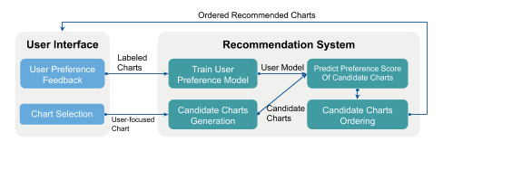

# VisGuide: Creating Visualization Trees with User-oriented Recommendations

## Introduction
**Data stories** are increasingly popular as a means for representing and organizing observations and patterns extracted from raw data. 

Previous works proposed the use of **visualization sequences** to represent data stories, using heuristics to automatically arrange charts in a meaningful order. While this approach performs well in specific scenarios, it has some limitations:

* The limitation of the diversity and the flexibility of the output visualization sequences.
* It does not customize the generated sequences to individual users' preferences
* Most of the existing methods arrange charts with a linear, tile or tree layout. For those layout types, their lack of a notion of extended branches requires considerable more effort from users to grasp the overall context spanning multiple charts.

We proposed **VisGuide**, an interactive visualization tree generation tool that helps users create coherent visualization trees by recommending meaningful charts tailored to each user's data-exploration preferences. 

The contributions of VisGudie:

* It is an interactive data exploration environment with recommendations to help users iteratively organize multiple visualizations into a visualization tree
* It  provides user-oriented recommendations using an online learning method that considers data statistics, visualization relations, and user preferences
* It effectively uses a novel tree format, *ViStory Tree*, to support a systematic  presentation of the complex relations among multiple visualization sequences

## User Interface

  

### Tree View 
Presents the generated visualization trees.
### Recommendation View
Shows the next chart recommendations of the user-focused chart (Chart C). There are **Drill-down** and **Comparison** two types of the recommendation.
### Sheet Management Bar
Supports users to create multiple visualization trees by adding a new sheet. Users can also switch among the sheets to compare the explored results.

[DEMO VIDEO](https://drive.google.com/file/d/1l28CLZgooxq0PeRy9tMNBYdWOQl_s5R9/view?usp=sharing)

## Method
### System Overview

  

The system consists of two groups of components: a **user interface** and a **recommendation system**.

The **user preference feedback module:** will collect a user's preferences to charts based on his/her interaction with the system and thus get a set of labeled charts. **Chart selection module:** allows users to show their further exploration intentions by clicking on their interested data points in charts (user-focused charts). This action will also trigger VisGuide's recommendation generation process. The recommendation system then uses the user-clicked information about the user-focused chart to generate a set of **candidates of next charts**. Besides, the labeled set of charts generated from the **user preference feedback module** will be used to **train users' preference model**. Afterwards, the recommendation system will predict the preference score of each candidate chart using the users' preference model. VisGuide then presents these charts in a descending order of preference score in the Recommendation View of the user interface.

The selected charts are arranged in a **ViStory Tree**, with which the user can intuitively organize them into a systematic presentation of the structure and patterns of a data story. The above procedures will be repeated to form a insightful visualization tree.

### User Preference Feedback

### Candidate Chart Generation
### User Preference Model Training
### ViStory Tree

## Evaluation

## How to launch VisGuide

## Dataset
[Download Datasets](https://drive.google.com/drive/folders/13CNfDDpSL_Lyk4QCw4QT9PAJfAulPEzh?usp=sharing)

**Acknowledgment**
Jia-Yu Pan, Wen-Chien Lin
